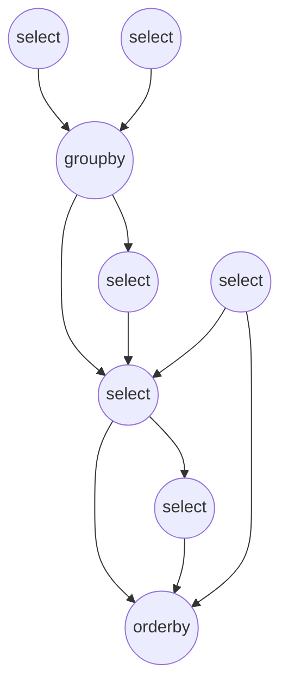
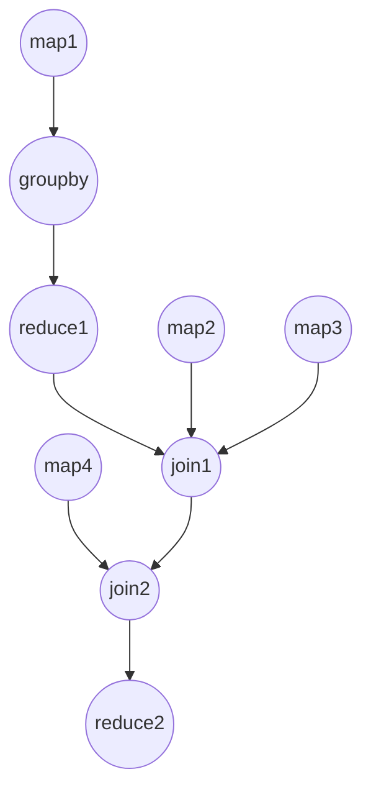
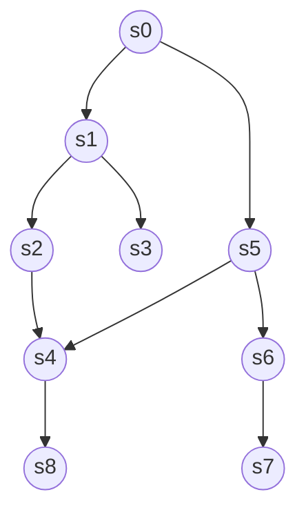

# DAGs

## Q1

```mermaid
graph TD

sr_customer_sk_sr_store_sk((groupby))
store_returns((select)) --> sr_customer_sk_sr_store_sk
date_dim((select)) --> sr_customer_sk_sr_store_sk
customer_total_return_ctr1((select))
sr_customer_sk_sr_store_sk --> customer_total_return_ctr1

customer_total_return_ctr2((select))
sr_customer_sk_sr_store_sk --> customer_total_return_ctr2
customer_total_return_ctr2 --> customer_total_return_ctr1
store((select))
customer_total_return_ctr1 --> store
customer((select)) --> customer_total_return_ctr1
c_customer_id((orderby))
customer_total_return_ctr1 --> c_customer_id
store --> c_customer_id
customer --> c_customer_id
```

## Q95

```mermaid
graph TD

map1((map1)) --> groupby((groupby))
groupby --> reduce1((reduce1))
reduce1 --> join1((join1))
map2((map2)) --> join1
map3((map3)) --> join1
map4((map4)) --> join2((join2))
join1 --> join2
join2 --> reduce2((reduce2))
```

## T0

```mermaid
graph TD

0((s0)) --> 1((s1))
1 --> 3((s3))
1 --> 2((s2))
0 --> 5((s5))
2 --> 4((s4))
5 --> 4
5 --> 6((s6))
6 --> 7((s7))
4 --> 8((s8))
```

