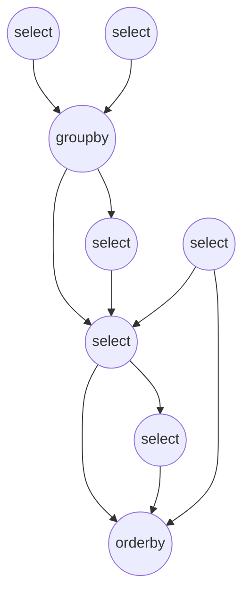

# DAGs

## Q1

```mermaid
graph TD

store_returns((select)) --> sr_customer_sk_sr_store_sk
date_dim((select)) --> sr_customer_sk_sr_store_sk
customer_total_return_ctr1((select))
sr_customer_sk_sr_store_sk((groupby)) --> customer_total_return_ctr1((select))

customer_total_return_ctr2((select))
sr_customer_sk_sr_store_sk --> customer_total_return_ctr2
customer_total_return_ctr2 --> customer_total_return_ctr1
store((select))
customer_total_return_ctr1 --> store
customer((select)) --> customer_total_return_ctr1
c_customer_id((orderby))
customer_total_return_ctr1 --> c_customer_id
store --> c_customer_id
customer --> c_customer_id
```

